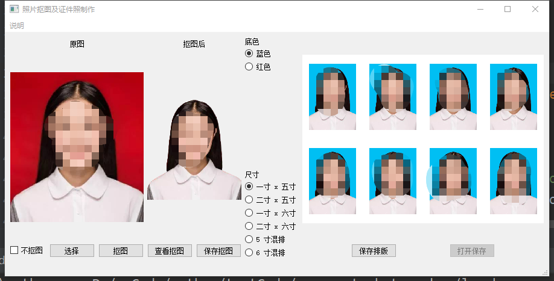

# passport_photo_maker
证件照制作

调用remove.bg的api去除背景，可以制作不同尺寸和不同底色的证件照

软件使用截图

# 使用

1 申请api key，https://www.remove.bg/

2 在data/settings.json中配置api key

3 安装 requiements.txt中的依赖

4 python lancher.py 

# 注意事项

先选择原图，之后点击抠图

如果不想抠图，只是制作证件照，勾选不抠图

查看抠图可以放大缩小图片，用于确认抠图效果

requests可以升级下版本